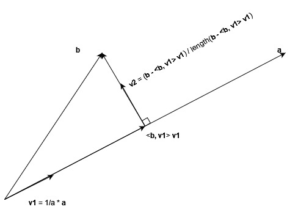

# A Nu Start

It is probably intuitive that if you specify the lengths of two lines and the angles between them, then the tip-to-tip distance of the two lines is fixed, and can be calculated.  Let's look at an example below.  There, we assume that $a$ and $b$ are the two lines, and $C$ is the angle between them.  If we specify values for those three parts, then the length of $c$ is also determined.

```{r, echo=FALSE, out.width="75%", out.height="75%", fig.align="center", fig.cap="Pythagorean Theorem, Law of Cosines"}
knitr::include_graphics('images/LofC-PythThm.jpg')
```

If $C$ is a right angle, like above, we can calculate $c$ via the Pythagorean Theorem:

$$(\text{Pythagorean Theorem}) \ \ \ \ \ c^2 = a^2 + b^2$$
However, if $C$ were not a right angle, but instead was any old angle, you could still compute the length of $c$ if you knew the angles $c$ makes with $a$ and $b$.  It should be straightforward to see in the diagram that:

$$(1) \ \ \ \ \ c = b \ cos(A) + a \ cos(B)$$

With some fancy trigonometry, you can find a formula for $c$ (or equally, $c^2$) with a formula that involves just the angle $C$ instead of angles $A$ and $B$.  We call that formula the **Law of Cosines**:

$$(\text{Law of Cosines}) \ \ \ \ \ c^2 = a^2 + b^2 - 2 a b \ cos(C)$$

You can see that it looks a lot like the Pythagorean Theorem.  In fact, when $C$ is 90 degrees, the last term is $0$, and we are back to the Pythagorean Theorem.

That was a whirlwind tour of some nice formulas, and I didn't even annoy you with a proof of the Law of Cosines.  It is nothing special, and just involves some clever trigonometric substitutions and identities using the sum of angles formulas, available anywhere you can search the internet.

One thing I'd like to highlight here is that the relationships that are helpful are posed as quadratics.  That is, the Pythagorean Theorem relates the squares of the sides.  If you were to talk in units, these relationships are in terms of $length^2$, not straight $length$.  That quadratic relationship makes some things a bit harder, but other, more important things, a bit easier.

What I really want to highlight are some aspects of this problem that turn out to be the ones we need to hold on to when we want to develop the heavier machinery of linear algebra, where in many cases we can't always run back to a nice geometric picture to look at.


## Lines that run roughly in the same direction

Let's go back to the triangle at the top of the page.  Look at $b\ cos(A)$, and imagine if you pull the point $C$ straight up, following the path the perpendicular dotted line would go if it kept going up.  What happens?  Well, angle $C$ gets smaller, and sides $b$ and $a$ get longer and longer.  But the part of $c$ made up by $b\ cos(A)$ keeps staying the same length.


```{r, echo=FALSE, out.width="75%", out.height="75%", fig.align="center", fig.cap="Triangles with same third side length"}
knitr::include_graphics('images/Triangles-bcosA.jpg')
```

In fact, if you make any triangle with the same horizontal line, and a vertex somewhere on the dashed line, then $b\ cos(A)$ will be the same for any triangle you make in this manner.

Another way to think of this is: how much of $b$ accounts for the total length of $AB$?  In all of the triangles shown, the answer is: equal amounts.  As the vertex gets further away from $AB$, $b$ gets *longer*, but points in a direction that is more away from $AB$ than in the same direction of it.

This idea -- the interplay of line lengths and how much they do or do not point in the same direction -- is at the heart of *inner products*.  Inner products can be used in many different disguises in different situations.  But here, in normal-geometry Euclidian space, the inner product, also known as the dot product in this space, of two lines is the product of the length of those two lines and the cosine of the angle between them.  That "cosine of the angle between them" accounts for how much in the same direction the two lines are pointing.


```{r, echo=FALSE, out.width="75%", out.height="75%", fig.align="center", fig.cap="Zero inner product of b and c"}

```

One more important observation... In the above, when $A$ is a right angle, there is no $b\ cos(C)$ component, or really, it is 0.  Because $b$ and $c$ are pointing perpendicular to each other.  In other words, $b$ doesn't point at all in any direction of $c$, so the inner (dot) product is zero.  This is a condition, called *orthogonality*, that we will heavily exploit in all of linear algebra.  You can get a hint as to why... in this case, we get a right triangle, and the relation of the sides is given by the Pythagorean theorem, which has simpler terms than the Law of Cosines.  This "zero inner product" condition will be exploited to make computations relatively straight-forward, and interpretations will be simplified as well.


## Inner Products

A quick note here -- I'm goint to be somewhat fast and loose with talking about line lengths, like $c$, and the same line as a vector, which I'll write as $\vec{c}$.  I'll probably need to become more precise on further revisions, but keep this in mind as you read...

Let's look at that adjustment factor to the Pythagorean Theorem in the formula *(The Law of Cosines)* that allows us to calculate any third side knowing the other two.  Taking out the factor of $-2$, we are left with:

$$(2) \ \ \ \ \ a b \ cos(C)$$
That's the inner product of the vectors $\vec{a}$ and $\vec{b}$, with $C$ being the angle between those two vectors.  We write inner products in Euclidian space like:

$$\vec{a}\cdot\vec{b} = a b \ cos(C)$$
There's reason we went through all of these gymnastics, to come up with the *Pythagorean Theorem* and the *Law of Cosines*, and that is this: it will simplify some other uglier calculations down the road, and we'll talk about those.

Let's talk about vector spaces.  I'll make assumptions at this point that you know what this is, in at least a geometric sense.  It's the Euclidian space where you draw arrows, and you can add two arrows graphically by placing the tail of one vector on the head (arrow) part of the other, and drawing a new arrow from the base of the one vector to the tip of the other one.  And you can "scalar multiply" an arrow by multiplying it by a real number, and that real number will make a new arrow along the same direction as the original arrow, but whose length is changed by the magnitude of the scalar (real number).  Negative numbers will reverse the direction of the arrow, but the length is still changed by the magnitude of the scalar.

```{r, echo=FALSE, out.width="75%", out.height="75%", fig.align="center", fig.cap="Vector addition, scalar multiplication"}
knitr::include_graphics('images/parallelogram-decomposition.png')
```

In the above picture, we have made the picture so that if you scale $\vec{v1}$ by $a1$ and $\vec{v2}$ by $a2$, and add them together, you get $\vec{r}$.  Or:

$$\vec{r} = a1\cdot\vec{v1} + a2\cdot\vec{v2}$$

*Spoiler alert:* inner products are the thing you need to compute to figure out the values for $a1$ and $a2$.

Here's the rub: vectors in a vector space are pretty much an unmanageable mess unless you put some effort into organizing them.  The easiest way to make an accounting system is to pick a certain number of special fixed vectors and *write every other vector in terms of those special vectors.*  One thing to know is, in general, there are a lot of vectors sets you could choose to write all other vectors in terms of.  The art of working with your vector spaces is to pick sets that make whatever problem you are working on easier.

For Euclidian space, the number of vectors you pick depends on the *dimension* of your space.  So, $\mathbb{R}^2$, or the Cartesian Plane, requires that you pick only two vectors (and those vectors can be any two vectors as long as one isn't a scalar multiple of the other).  $\mathbb{R}^3$ takes 3 vectors (and in that set of 3, the restriction is that you can't write one of those vectors as a sum of scalar multiples of the other two).  And so on.

Once you have your set of special vectors that meet the above criteria (this set is known as a *basis*), you can write any other vector as a sum of scalar multiple of those vectors.  For example, if you've picked two vectors $\vec{v1}$ and $\vec{v2}$ from $\mathbb{R}^2$, with the restriction above, you can write any other vector $r$ in terms of them.  To repeat our formula:

$$\vec{r} = a1\cdot\vec{v1} + a2\cdot\vec{v2}$$
And for any $r$, you can find scalars $a1$ and $a2$ that will make this work.  The key is: *how do you find $a1$ and $a2$?*.

The answer is: inner products.  Without going through the grungy math, I will give you the grungy result, to which I will say: **Don't scrutinize this too much.** I just want to make the point that the scalars you need can be calculated in terms of the following operations: inner products, addition, subtraction, multiplication, and division.


$$a1 = \frac{(\vec{v1}\cdot\vec{v2})\cdot(\vec{v2}\cdot\vec{r})-(\vec{v2}\cdot\vec{v2})\cdot(\vec{v1}\cdot\vec{r})}{(\vec{v1}\cdot\vec{v2})^2 - (\vec{v1}\cdot\vec{v1})\cdot(\vec{v2}\cdot\vec{v2})}$$

$$a2 = \frac{(\vec{v1}\cdot\vec{v2})\cdot(\vec{v1}\cdot\vec{r})-(\vec{v1}\cdot\vec{v1})\cdot(\vec{v2}\cdot\vec{r})}{(\vec{v1}\cdot\vec{v2})^2 - (\vec{v1}\cdot\vec{v1})\cdot(\vec{v2}\cdot\vec{v2})}$$

Not the prettiest thing, but computable!  And that is the goal.  It may seem harder, but know that it is indeed far easier to pick a set of vectors and do these computations to represent them than it is to not have that.

The idea is: basic arithmetic and inner producst are cheap/easy to compute.  Keeping track of scalars is also cheap/easy.  Keeping track of individual vectors is hard.  The easiest compromise is to use the fewest individual vectors, and as many scalars and vector additions as needed to decompose any given vector into a set of pre-picked vectors.  That's what a *basis* is: a pre-picked set of vectors with which we can express any other vector we want.


## Orthogonality and Normality

Those calculations are indeed a bit gross, so people have looked for ways to make that not so gross.  Above we noted that when the angle between vectors is 90 degrees, the cosine is 0.  That means that if the angle between $\vec{v1}$ and $\vec{v2}$ is 90 degrees, then $\vec{v1}\cdot\vec{v2} = 0$.  If you, at the outset, *pick* the vectors $\vec{v1}$ and $\vec{v2}$ to be ones where the angle between them is 90 degrees, then the above calculations simplify greatly to:

$$a1 = \frac{\vec{v1}\cdot\vec{r}}{\vec{v1}\cdot\vec{v1}}$$

$$a2 = \frac{\vec{v2}\cdot\vec{r}}{\vec{v2}\cdot\vec{v2}}$$
With this simplification, you should think, "Wow, I should probably choose my vectors to be perpendicular to each other!"  And that is what orthogonality is -- vectors whose inner products are 0.  When they are geometric vectors, like above, orthogonality is a synonym for perpendicularity.  We just use *orthogonality* in the future when we have inner product, but not good geometry to go with them.

To go one step further, as the dot product of a vector with itself is the square of the length of that vector, you can get even simpler expressions above if the length of $\vec{v1}$ and $\vec{v2}$ are $= 1$.  Then you can forget about the denominators, as you then get:

$$a1 = \vec{v1}\cdot\vec{r}$$
$$a2 = \vec{v2}\cdot\vec{r}$$
Having length one also has a general name, called being *normal*, or *normality*.  And it too helps simplify calculations, like above.  You can always compute a vector that is normal and in the same direction as your original vector if you divide the vector by its length.  Or, scalar multiply it by its reciprocal length.  So, for any vector $\vec{v}$, regardless of length (other than 0), the following vector will have length 1:
$$\frac{1}{\sqrt{\vec{v}\cdot\vec{v}}}\cdot\vec{v}$$
Again -- same direction as $\vec{v}$, but of length 1.


### Gram-Schmidt Orthonormalization

Big words, straightforward idea.

Also note: there is a second notation for inner products: $<\vec{a},\vec{b}>$.  I use this convention here because it was easier to deal with in my pictures.  Also, this notation is used for other places where you have the concept of inner product, but it isn't necessarily a run-of-the-mill Euclidian space.

TL;DR: Given a set of vectors that form a basis, but are not necessarily orthogonal to each other, or normal, You can use those vectors to create another set of vectors that will work as a basis, *and* those vectors will be orthonormal.

Often, starting vectors for a given problem just kind of fall into your lap, and they are not orthogonal at the start.  So how do we actually make an orthonormal set from one that isn't?  Luckily, if you can use those starting vectors (that are not orthogonal) to make all of the other vectors you want, like above, you can can calculate a new set of vectors that will do the same thing, *and* those vectors will be orthonormal.  Here is a picture -- note the algebra looks worse than it is.

```{r, echo=FALSE, out.width="75%", out.height="75%", fig.align="center", fig.cap="Gram-Schmidt: algebra looks worse than it is."}

```

Here's the idea, in straightforward language.

* Take your two vectors, $\vec{a}$ and $\vec{b}$, and pick one of them to start.  Say, $\vec{a}$.
* Normalize it by dividing by it's length, and call the result $v1$.  Congrats, you have your first normal vector of your new orthonormal set.
* Find the spot/vector along $\vec{v1}$, which is the same line/direction as $\vec{a}$, that will make a right triangle with $\vec{b}$.  Turns out, this calculation is straightforward, and is $<\vec{b},\vec{v1}>\ \vec{v1}$, or $(\vec{b}\cdot\vec{v1})\ \vec{v1}$.
* Subtract that from $\vec{b}$, which is $\vec{b} - (\vec{b}\cdot\vec{v1})\ \vec{v1}$.  What you are left with is a vector perpendicular to $\vec{v1}$, so you are almost home.
* Divide that vector by its own length so that you have a normalized vector: $\vec{v2} = \frac{1}{length(\vec{b} - (\vec{b}\cdot\vec{v1})\ \vec{v1})}\ (\vec{b} - (\vec{b}\cdot\vec{v1})\ \vec{v1})$. Not as ugly as it seems.  Congrats, you now have an orthonormal basis with $\vec{v1}$ and $\vec{v2}$.

This process can be extended to more than 2 dimensions.  It is a process of taking vectors, scaling them to length 1 for normalization, finding projections (making right triangles and picking the cosine leg), subtracting it from your next vector, and then normalizing again.  It's like a great big geometric construction you might have done in geometry in high school with a compass and straight-edge.  The process gets a little more algorithmically hairy for more dimensions, but it is repeating this same idea/process over and over again.


We will call the set of vectors that you can use to represent any other vector (with scalar multiplication and addition) as a *basis*.  If all of the vectors in that basis are of length 1 and are perpendicular, we call that an *orthonormal basis*.


## Summarizing the big points

We've only worked with $\mathbb{R}^2$, but we've learned a lot and scaffolded ourselves to work with some more abstract ideas.  They are:

* You can generalize the Pythagorean Theorem via the Law of Cosines.  This allows you to compute the length of any leg of a triangle from the length of the other two sides and the angle between the other two sides.
* The Law of Cosines has embedded in it a quantity we end up calling the *inner product* of two vectors.  This gives some measure of how much in the same direction two sides of a triangle point, and incorporate the length of those two sides so that ultimately you can get a Pythagorean Theorem like equation.
* If we pick the right vectors, we can use the inner product, and standard addition/subtraction/multiplication/division to compute coefficients that can be used with those vectors to represent any other vector we want.
* It's easier if the vectors we use to write other vectors with are mutually perpendicular and of length 1 (orthonormal).
* We can always make an orthonormal set using the Gram-Schmidt process.


