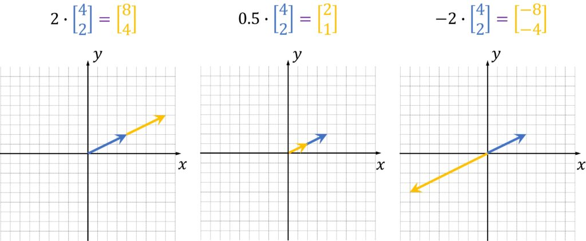
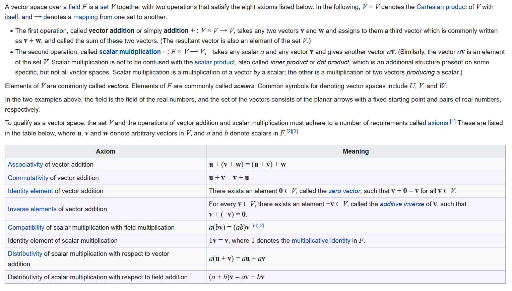

# Well, How Did I Get Here?

> It takes a very unusual mind to undertake the analysis of the obvious.
>
> Alfred North Whitehead

At this point, if you are reading this as opposed to an intro to linear algebra book, I assume the one thing you have is a good familiarity with are the vector spaces of $\mathbb{R}^2$ and $\mathbb{R}^3$.  These are the vector spaces used extensively in physics and engineering to model things like position, velocity, and forces.

You know that you can add two vectors by putting the tail of one vector at the head of the other and connecting the base of one to the tip of the other vector.

```{r, echo=FALSE, out.width="75%", out.height="75%", fig.align="center", fig.cap="Parallelogram Law of Addition"}
knitr::include_graphics('images/vector_parallelogram_law.png')
```

And we know how to stretch, shrink, and flip a vector, which we do by multiplying a vector by a real number.  If you multiply a vector by $1/2$, the length of the vector shrinks to one-half its original length (but the direction doesn't change).  If you multiply a vector by $3 \sqrt{2}$ the magnitude of the result is stretched by that amount.

```{r, echo=FALSE, out.width="100%", out.height="100%", fig.align="center", fig.cap="Vector Scaling"}

```

These are the prototypical vector spaces, one I'd argue 99 times out of 100 people imagine if they know what a vector space is already.  And if this is the only space you have to deal with, this intuition is pretty much all you need.  It will take you far. But if you study quantum state space vectors, with their complex entries, and the notion of $\mathbb{R}^n$ vector spaces can help some of your intuition, and for other parts, you are totally at sea as to how the hell you are supposed to interpret things.

So it may help to go back to $\mathbb{R}^n$ and do some careful syntax-to-interpretation explanations.  And take some of the things we take for granted as obvious and cast them in new, abstract lights.


Before we get to the vector space axioms, let's review our intuitions a bit more about $\mathbb{R}^n$ vector spaces.

## Intuition about $\mathbb{R}^n$

We already discussed how addition and scalar multiplication are performed.  But we should note the choices we made to do what seems so natural to us.

First, addition.  We did it using the parallelogram law.  How come we didn't choose to make the resulting vector have a length equal to the sum of the length of the two starting vectors?  You can see from the picture the length of our resulting vector is usually shorter, but never longer, than the length of the two vectors you are adding.  You should counter, "well, that's because things like forces don't work that way.  If I have two equal and opposite forces acting on an object, I want the result to be no net force.  If the magnitudes were added, which direction would the result point?  Doesn't make sense, so we can't use that because it doesn't model the situation."

Good answer, reader!

We want our model to reflect what is going on.  So that sort of addition is out.  It turns out head-to-tail addition does model things like forces.  What is also intuitive is that for any arrow, or force, or velocity, you can "counteract" it with another arrow/force/velocity.  You could not do this if the magnitues themselves always add.  You can never add two positive things to get a net zero, which would represent two things counteracting each other.

Second, just what do we mean by multiplying a vector by a scalar?  That's a little trickier.  We know what we mean: we shrink and grow the vector, in the same direction, by the scalar's sign and magnitude.  As above, multiplying a vector by $1/2$ shrinks its length to $1/2$ the original length, but the direction stays the same.

But if you are an engineer or scientist, your unit-analysis Spidey-sense should start to tingle... if scalars and vectors are different things, and I multiply them, whatever happens, I shouldn't get a vector out, like we are seeing.

A dirty little detail is usually glossed over.  Because it is short-circuiting to your intuition about stretching or shrinking, people don't talk about what $\alpha \vec{x}$ is.  Your brain probably assumes it is a multiplication, and what the scalar is multiplying is the "magnitude" property of the vector.  You can think about it that way for $\mathbb{R}^n$ vectors.  But that's not really a scalar-vector multiplication.  What it really is is the scalar acting as a function that maps a vector to another vector.  Like so:

$$ f_{\alpha} : V \to V , \alpha \in \mathbb{R} $$
So, $\alpha \vec{x}$ is really shorthand for $f_{\alpha}(\vec{x})$.

For $\mathbb{R}^n$, that function is the function that stretches or shrinks the magnitude of the vector by $\alpha$.  Again, this may seem like nit-picky pedantry, but we have to start leveraging this fact in the near future to keep some other things clear...


## The Axioms

So if vector spaces were just stretching and head-to-tail vector additions, mathematicians probably wouldn't make the seemingly awkward definition that are always presented in the first three pages of any textbook:


From Wikipedia:

```{r, echo=FALSE, out.width="100%", out.height="100%", fig.align="center", fig.cap="[Record scratch]  Yep, that's me, Vector Space, spewing a lot of incomprehensible stuff.  But I wasn't always like this.  Let me tell you a story..."}

```

It is a bad way to start, because you really have no frame of reference for what any of the terms mean.  It is frustrating and made me angry  **We shouldn't really start here.**

This reminds me of the joke about a cab driver driving around the Seattle area in a fog, and he asks a guy coming out of a building if he can tell the cabbie where he is.  The guy looks at him and says, "You're in a cab," and walks on.  The cabbie says "Perfect, I know where I am."  The fare asks him how he can figure out anything from what the guy outside said, and the cabbie say, "Well, he told me something that was completely true and completely useless.  So this must be the Microsoft building."

There's so many questions that should be triggered.  Like:

- Why so many simple axioms?
- What are vectors, really?
- What is a field, really?
- What does it mean to add vectors?
- What does it mean to multiply a vector by a scalar?
- How do I know what other vector $a \cdot \vec{u}$ becomes?
- It looks like the scalar field talks about how *scalar addition* and *scalar multiplication* works.  But vectors only talk about *vector addition*.  What's up with that?

With $\mathbb{R}^n$, we can look over the axioms and confirm that yep, they meet the axioms, because we have a strong intuition about how addtion of vectors work, how scalars stretch the vectors, and how the addition and multiplication of scalar (read: real) numbers work.

We can boil these axioms down as follows:

- It won't matter what order you do your operations in, you are guaranteed to get the same answer.  All of the axioms that deal with associativity, commutativity, compatibility, and distributivity are telling us.
- Your vector space has an element that acts as a $\vec{0}$ element, and every vector has an opposite that, when you add them together, gives you $\vec{0}$.
- Your scalar field, which has a $\vec{1}$ in it, when combined with a vector, won't change that vector.

But that doesn't answer why we say what we want in a vector space that way.  Even more, we don't have a good idea of what other structures my meet these axioms and be a vector space.  Or how to interpret that.


## Why are the axioms this way?

In elementary school, you learned your 1-digit by 1-digit times tables by rote.  And then you learned how you could leverage that to multiply numbers bigger than 1-digit together by using the 1-digit table entries, putting the results in certain columns, learning how to carry, write down partial sums, and add them together.  You need only know the 1-digit times tables and a procedure with special addition rules to handle the multiplication of any two numbers of any length.

*That* reduction to a set of memorized computations and easy rules to combine the results to get us any arbitrary computation is what we are striving for in vector spaces.  We don't want to have to memorize the sum of every two-vector combination in the space, because by my last count, I'm pretty sure there are more than 57 vectors in $\mathbb{R}^2$ alone.  What we want is a nice way to get a fixed set of facts we have to know about, and find simple procedures to compute the facts only as we need them.

So here's the game plan, to try and tackle complex things like $\mathbb{R}^n$ and other things that will qualify as vector spaces.  We are going to reference some topics that will be familiar to you if you've dealt with linear algebras before, but haven't talked about yet here:


| Task | Vector space concept |
|-------------------------|----------------------|
| Get a fixed number of facts (vectors $\vec{x}_{i}$) we need to deal with, like the times table. | Pick linearly independent vectors $\vec{x}_{i}$.|
| Figure out how to express them as simple combinations of known facts| Linear combinations with scalars: $\vec{x} = \alpha_{1} \vec{x}_{1} + \alpha_{1} \vec{x}_{1} + ... + \alpha_{n} \vec{x}_{n}$. A minimal set of linearly independent vectors that can do this is called a *basis*. |
| Discover that for vector spaces (finite ones), any set of vectors that work to do this *always* has the same number of vectors | This is the dimensionality $N$ of the space.|
| Figure out how to calculate $\alpha_{i}$ for a given set of vectors. | To do this, we'll have to create the concept of the *inner product*.|
| Find out that lots of choices of $\vec{x}_{i}$ will work to express any vector, but *certain* ones are easier to compute the $\alpha_{i}$'s for. | These will be vectors that are orthogonal and of a certain size (magnitude = 1).  The word that captures both of these concepts is *orthonormal*. There are still lots of orthonormal sets.|
| Figure out how to take an arbirary linear independent set and construct an equivalent orthonormal set out of them, because they are easier to deal with. | This is the Gram-Schmidt theorem.|

This will be enough for now.  Once we get into functions *between* vector spaces, and pick out the special functions (the *linear* transforms), we'll talk about what *eigenvectors* and *eigenvalues* are.  But not yet.

The insight here is that for a given vector space, rather than work with the raw vectors themselves, it is easier to break them down into computations on known vectors (the basis), and do scalar multiplication (really, mappings that work like the underlying arithmetic on the scalars) on those basis vectors.  This is because the operations on the scalar field, and the way they map (or stretch) the basis vectors is ultimately an easier accounting scheme.  So we go through all of this work to find linear independent sets, basis, orthonormal bases, an inner product function, etc., so that we can use the inner product to easily get scalar coefficients and go on our merry way doing calculations on the vector space elements themselves.


...


You could think about this as follows: all you have are the vectors, and you are given a really big set of rules that tells you what vector you get when you add any two vectors.  You just have to find that rule in the set.  It would be like memorizing your times tables way way far beyond your 1-digit by 1-digit table you have in elementary school.  Some savants do this to perform faster computations -- they may memorize all 2-digit by 2-digit products, and that can significantly speed up their already fast computations.  Some even have some key 3-digit by 3-digit products memorized.

If you think about it, in $\mathbb{R}^n$, that scalar relationship is a pattern you notice about how the vectors adhere to.  But it isn't necessary -- you could just memorize what resulting vector you get when you add any two vectors together.

Here's one of the guiding intuitions about vector spaces.  Vector spaces are huge.  Like, I'm pretty sure there are more than 57 vectors in $\mathbb{R}^2$ alone.


The point here is this: we have a good intuitive idea of how vectors behave in $\mathbb{R}$ spaces.  As we stated above, we can just follow our noses: scalars can be added and multiplied, vectors can be added, and we can put them together in ways such that if we construct a vector $\vec{x} = \alpha_{1} \vec{x_{1}} + \alpha_{2} \vec{x_{2}}$, we can figure out exactly what vector $\vec{x}$ we must have.

But we don't *have* to rely on that geometry of arrows in general, and how they stretch and add with the parralelogram rule.  We don't have to have any idea what the elements of the vector space really look like (as in, they don't have to be arrows in $\mathbb{R}$ space).  They just have to be objects that have a vector $+$ structure, and you can define some maps on those objects, which you can *label* with scalars (from $\mathbb{R}$ or $\mathbb{C}$, as we'll see), and they just have to obey the axioms.  We will need to lift off from this $\mathbb{R}$ prototype of vector spaces for some of the vector spaces we will use in quantum theory.  At first, you will want to use your intuition about $\mathbb{R}$ to reason about these more abstract vector spaces (the quantum "state space"), but it won't *quite* work, and you'll need this more sophisticated abstraction.

In the next chapter, we'll take some quantum phenomenon, and figure out how we pick linear algebra to model our phenomenon, and what tools from its toolbox we will need.  And illuminate a little more how linear algebra hangs together.
