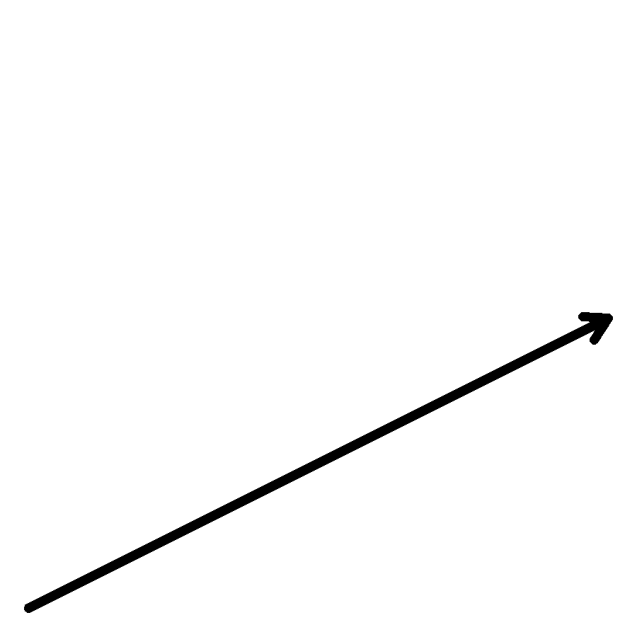
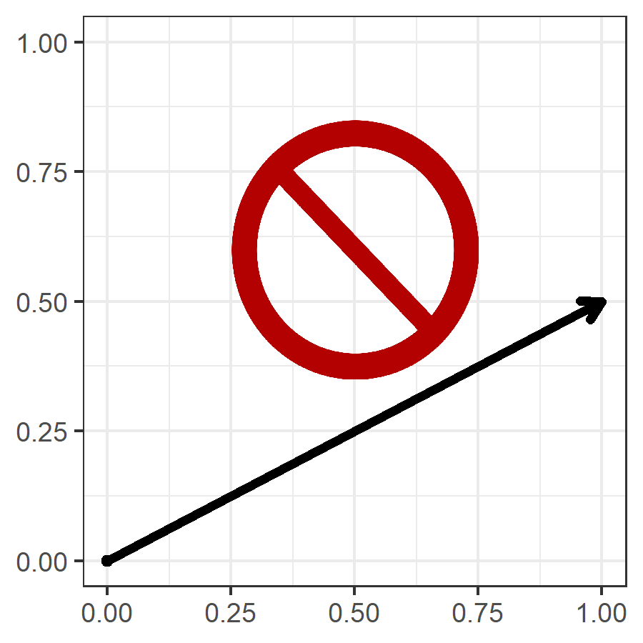
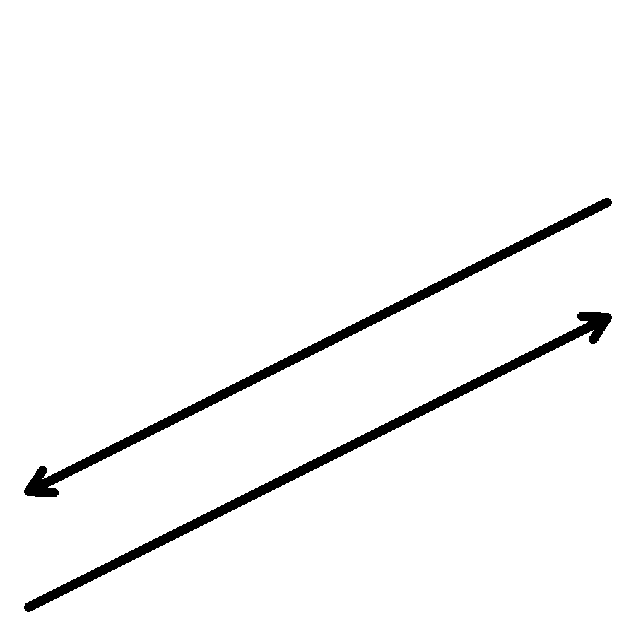
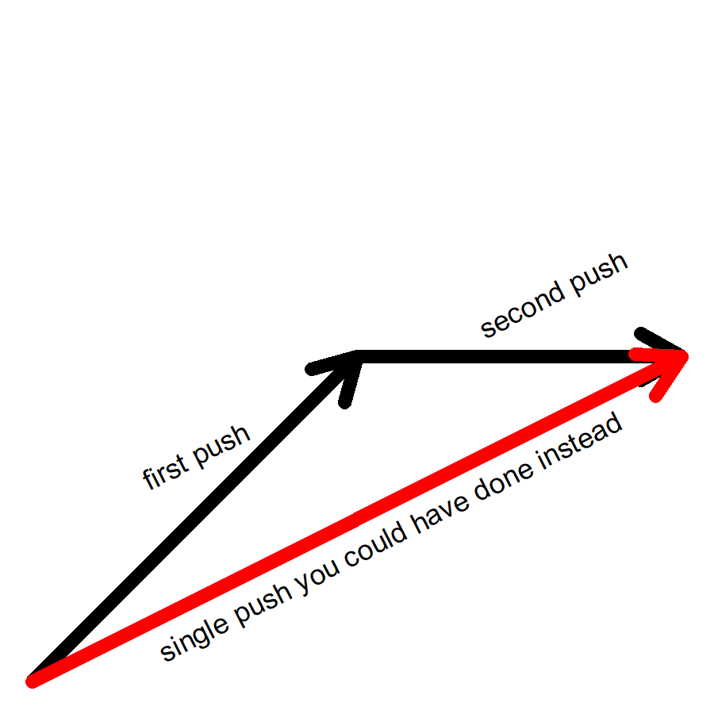
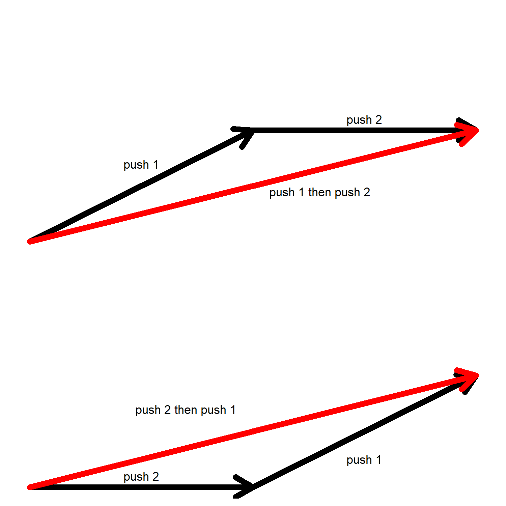
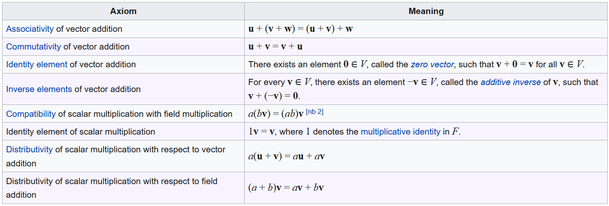

# Well, How Did I Get Here?

> Note: I am going to give a physical motivation for vectors here.  If you know this pretty well, feel free to skim it.

Let's dive in by making up a scenario that is half-realistic in the surroundings, and half fantasy in the activities you choose to engage in.  The former grounds us in images we can relate to, the latter reminds us that scientists do think of weird things to with their time, and those things are often fruitful to humanity.

Living in Minnesota, you discover that one of the recreations is pushing things around on ice sheets.  We are a fascinating lot.  So, let's imagine you are on a frozen lake with a liter bottle of vodka.  This activity is commonly known as "ice fishing" here, though many people never come home with fish.

So you decide to just kick the bottle around for a while before you drink it.  While doing this, you make some pretty obvious observations that surprise no one at this point, but for some reason, stick with you.  They are:

- The harder you push on the bottle, the faster it ends up going.
- The bottle goes in the direction you push it.

Yes, you are a genius for making this observation.  As I said, half of the things we do in the story are fantastical things you really wouldn't do with a bottle of vodka on the ice.

Still bored, you decide to try and be more precise about your observations.  So, you decide that you will only push on the bottle for one second spans of time.  When you do this, you make these observations.

- If you push twice as hard on the bottle, it will end up going twice as fast.
- No matter how hard you push, the bottle still goes in the direction you push it.  Generalissimo Francisco Franco is still dead.

In this scenario, I assume you have some way of guaging what "twice as hard" means.  For you physics buffs out there, yes, this is measuring the force you apply to the bottle.

After much hard thinking, you decide to start recording your observations.  Since the final speed and direction of the bottle depend only on how hard you push it and what direction you push, you decide to start keeping track of each combination of effort and direction with a drawn arrow.


```{r, echo=FALSE, out.width="50%", out.height="50%", fig.align="center", fig.cap="Rockin' Recording System"}

```

An arrow is perfect to capture what you want.  You can point it inthe direction you pushed the bottle, and you can make its length correspond to how hard you pushed it.  If an arrow is twice as long as another arrow, you pushed it twice as hard.

**NOTE: RESIST THE TEMPTATION TO LAY A COORDINATE SYSTEM ON THIS YET!**  We'll get there, but at this moment, we're not ready to deal with coordinates.  We just haven't assembled the tools to figure out how to get there.  THIS IS THE RIGHT INTUITION, but we have to do some more work beforehand.  It is enough to draw an arrow on a piece of paper in the same direction of the pushed bottle, and draw lengths that record relative magnitudes of how hard you are pushing.

```{r, echo=FALSE, out.width="50%", out.height="50%", fig.align="center", fig.cap="DON'T MAKE COORDINATES YET."}

```

As you do more and more experiments, you notice more things.  For instance:

## Stopping what you started

- The way you stop the bottle dead is to push on it again, in the exact opposite direction.

```{r, echo=FALSE, out.width="50%", out.height="50%", fig.align="center", fig.cap="Stopping the bottle"}

```


## Combo Moves and Equivalent Move

Another thing you notice: you can do combo moves.  You can give a push of one size in one direction, then a second sized push in another direction, and that result is the same as if you started with a push of a possibly totally different size in a totally different direction.  Well, that's not surprising.  What *is* surprising is that if you take your arrow from the first push, and then put the butt of the arrow from the second push at the arrow tip of the first push, and *then* draw an arrow from the start of the first arrow to the end tip of the (moved) second arrow, *that* arrow is the arrow that represents what direction and push size you could have started with to get the same result as you got with the two-combo push you started with.

```{r, echo=FALSE, out.width="50%", out.height="50%", fig.align="center", fig.cap="One push instead of two"}

```

Granted, if you do one push, and afterwards, do a second push, it won't be in the same *line* that a single push would give you, but... the two lines would be in the same direction and have the same speed at the end.  So we're going to call those equal.  That's a big decision, but since no other initial push could give you exactly the same path as the two combo push, it seems to make sense to call those equal.


## Order of pushing

- If you do two pushes in sequence, the result is the same no matter which order you do it in.

```{r, echo=FALSE, out.width="50%", out.height="50%", fig.align="center", fig.cap="Pushing order doesn't matter."}

```


## The Vector Space Axioms

```{r, echo=FALSE, out.width="100%", out.height="100%", fig.align="center", fig.cap="Vector space axioms from Wikipedia"}

```

