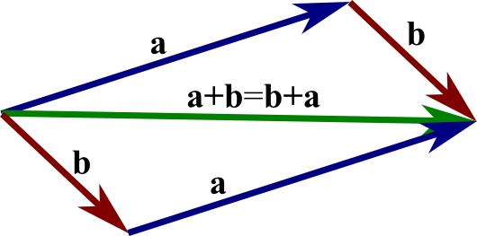

# Well, How Did I Get Here?

At this point, if you are reading this as opposed to an intro to linear algebra book, I assume the one thing you have is a good familiarity with are the vector spaces of $\mathbb{R}^2$ and $\mathbb{R}^3$.  These are the vector spaces used extensively in physics and engineering to model things like position, velocity, and forces.

You know that you can add two vectors by putting the tail of one vector at the head of the other and connecting the base of one to the tip of the other vector.  And we know how to stretch, shrink, and flip a vector, which we do by multiplying a vector by a real number.  If you multiply a vector by $1/2$, the length of the vector shrinks to one-half its original length (but the direction doesn't change).  If you multiply a vector by $3 \sqrt{2}$ the magnitude of the result is stretched by that amount.


```{r, echo=FALSE, out.width="75%", out.height="75%", fig.align="center", fig.cap="Parallelogram Law of Addition"}

```

```{r, echo=FALSE, out.width="100%", out.height="100%", fig.align="center", fig.cap="Vector Scaling"}
knitr::include_graphics('images/Vector-scaling.jpg')
```

These are the prototypical vector spaces, one I'd argue 99 times out of 100 people imagine if they know what a vector space is already.  If that was all that vector spaces were, mathematicians probably wouldn't make the seemingly awkward definition that are always presented in the first three pages of any textbook:


From Wikipedia:

```{r, echo=FALSE, out.width="100%", out.height="100%", fig.align="center", fig.cap="[Record scratch]  Yep, that's me, Vector Space, spewing a lot of incomprehensible stuff.  But I wasn't always like this.  Let me tell you a story..."}
knitr::include_graphics('images/vector-space-axioms-wikipedia_2.png')
```

It is a bad way to start, because you really have no frame of reference for what any of the terms mean.  It is frustrating and made me angry  **We shouldn't really start here.**

This reminds me of the joke about a cab driver driving around the Seattle area in a fog, and he asks a guy coming out of a building if he can tell the cabbie where he is.  The guy looks at him and says, "You're in a cab," and walks on.  The cabbie says "Perfect, I know where I am."  The fare asks him how he can figure out anything from what the guy outside said, and the cabbie say, "Well, he told me something that was completely true and completely useless.  So this must be the Microsoft building."

There's so many questions that should be triggered.  Like:

- Why so many simple axioms?
- What are vectors, really?
- What is a field, really?
- What does it mean to add vectors?
- What does it mean to multiply a vector by a scalar?
- How do I know what other vector $a \cdot \vec{u}$ becomes?
- It looks like the scalar field talks about how *scalar addition* and *scalar multiplication* works.  But vectors only talk about *vector addition*.  What's up with that?

We know from $\mathbb{R}^2$ and $\mathbb{R}^3$ how vector spaces works, and we can look over the axioms and confirm that yep, those vector spaces meet the axioms.  But that doesn't answer why we lay out the axioms that way.  Even more, we don't have a good idea of what other structures my meet these axioms and be a vector space.  Or how to interpret that.

Let's view the axioms in light of what we know about the $\mathbb{R}$ spaces:

- Vectors work the way you think they should, it kinda-sorta works like addition for regular numbers.
- Scalar multiplication works the way you think it should, it kinda-sorta works like addition and multiplication for regular numbers.
- Scalars have both addition and multiplication, while vectors only have addition.  That's gotta mean something.

Let's further focus on scalar multiplication.  In the $\mathbb{R}$ spaces, we intuitively know when you pick a scalar to multiply a vector by, you are stretching one vector into another, both vectors being same direction.  Another, more abstract way of thinking about this (and one that will be useful in the near future!) is that a scalar is a function that takes one vector to another one.  With our vector spaces, it's easy to see which one: if the scalar is $2$, it maps the vector to the one that is twice it's magnitude in the same direction.

But there's more to these scalars.  If you think of them as functions, per the axioms, adding two scalars will get you to a new scalar that will map vectors.  if $\alpha = \alpha_{1} + \alpha_{2}$ is your new scalar, and you operate on $\vec{x}$, it will work the same was if you operated on $\vec{x}$ with $\alpha_{1}$ and $\alpha_{2}$, and then added those two vectors together.  That is, $\alpha \vec{x} = \alpha_{1} \vec{x} + \alpha_{2} \vec{x}$.  This is a **strong** constraint on any function that moves vectors around -- that you can combine the scalars first and apply the operation, or apply the constituent scalars individually to $\vec{x}$ and use the vector $+$ operation to combine the individual applications.

This is the property claimed by the last axiom above.  We can go through the other axioms and make similar arguments for them, and make similar observations, each putting **very strong** constraints on how scalar multiplication and vector addition actually construct new vectors.  We really filter out a lot of functions that scalar multiplication and vector addition could potentially use in the vector space with these axioms.  The rules are really restrictive.

The point here is this: we have a good intuitive idea of how vectors behave in $\mathbb{R}$ spaces.  As we stated above, we can just follow our noses: scalars can be added and multiplied, vectors can be added, and we can put them together in ways such that if we construct a vector $\vec{x} = \alpha_{1} \vec{x_{1}} + \alpha_{2} \vec{x_{2}}$, we can figure out exactly what vector $\vec{x}$ we must have.

But we don't *have* to rely on that geometry of arrows in general, and how they stretch and add with the parralelogram rule.  We don't have to have any idea what the elements of the vector space really look like (as in, they don't have to be arrows in $\mathbb{R}$ space).  They just have to be objects that have a vector $+$ structure, and you can define some maps on those objects, which you can *label* with scalars (from $\mathbb{R}$ or $\mathbb{C}$, as we'll see), and they just have to obey the axioms.  We will need to lift off from this $\mathbb{R}$ prototype of vector spaces for some of the vector spaces we will use in quantum theory.  At first, you will want to use your intuition about $\mathbb{R}$ to reason about these more abstract vector spaces (the quantum "state space"), but it won't *quite* work, and you'll need this more sophisticated abstraction.

In the next chapter, we'll take some quantum phenomenon, and figure out how we pick linear algebra to model our phenomenon, and what tools from its toolbox we will need.  And illuminate a little more how linear algebra hangs together.
