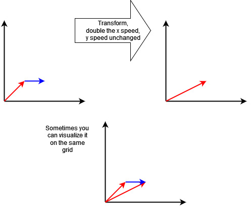
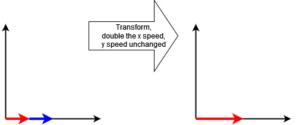

# Eigenvectors and Eigenvalues

Part of the motivation from the last chapter was to simplify calculations.  The simplification process was something like this:

* Instead of talking about each vector uniquely, find a small set of vectors through which you can express every other vector in that space you could possibly want to talk about.
* Be picky about that set, and pick the smallest set of vectors you can get away with.
* Find a relatively easy function (inner product) that makes calculating the scalars  that you need to use with that small set of vectors to represent any other vector.
* Be more picky about that small set of vectors (the basis) in a way that makes computing the scalars more computationally simple -- that is by selecting a set of vectors that are mutually orthogonal.  This makes a lot of terms in the scalar computation reduce to zero and make a simpler computation.
* Be even more picky about that set and make sure the *length* of the basis vectors are $1$.  This gives you an orthonormal basis.

These ways of being very picky about what basis set of vectors you choose to represent any other vector in the space pays off by making the scalar multiplier computations you need to make to get the right expression much more simple by introducing a lot of zero terms and unit multipliers and divisors.


## Transformations, Eigenvalues, and Eigenvectors

Let's talk about linearity for a bit.

Each vector, like in Euclidian space, are just collections of sets of numbers.  The value of each coordinate usually means something.  In Euclidian space, it is a measure of distance, say, of the first number being a measure of distance along the x-axis and the second number is a measure of distance along the y-axis.

Instead of distances, the coordinates could be velocities, like the possible velocities a plane could fly in the air.

Now let's talk about vector transformations, or functions.  Abstractly, this is just a function that maps a vector to another vector.  But let's look at a concrete example.

Assume you have an airplane, and you can fly it in any direction at any speed.  This represents a vector field, with each vector in the plane representing a different velocity the plane could have.

Now, let's say there is a malfunction in the engine that doubles your x-direction speed.  How does this affect the velocity of the plane you are flying?

```{r, echo=FALSE, out.width="75%", out.height="75%", fig.align="center", fig.cap="Applying a transformation, adding a prevailing wind to your plane velocity."}

```

This is a transformation of a vector field.  Every vector goes to another vector.  Above, we show one example.  You can visualize this as the malfunction throwing the plane off course in this example.

Now, what happens if we happen to actually be travelling in the $x$ direction?  Well, our speed will definitely change, but it won't throw us off course.

```{r, echo=FALSE, out.width="75%", out.height="75%", fig.align="center", fig.cap="Doubling the x-direction speed doesn't change the plane's direction."}

```

These vectors, which can change length or direction, but stay on the same overall line from where they started, are special vectors called **eigenvectors**.  You should see that *any* vector that points purely along the x-axis will not change direction.  By the rule, the y-coordinate stays the same, but the x-coordinate doubles, so the vector points in the same direction.

Furthermore, vectors that point purely in the y-direction don't change at all, since their x-coordinate is 0, and $2 x$ is $0$.  And they y-coordinate doesn't change, so the vector actually doesn't change at all.  So if you are travelling in the y-direction only, this malfunction can't affect you.  In short, if we call this transformation $A$, then

$$A([x, 0]^T) = 2 \cdot [x, 0]^T$$

$$A([0, y]^T) = 1 \cdot [0, y]^T$$

All other directions, apart from pure x- and y-directions, will have thier directions changed.

The amount that the eigenvector stretches or shrinks by is called the **eigenvalue**.  For the pure x-direction vectors, the eigienvalue is 2.  For the pure y-directions, the eigenvalue is 1.

Now, the thing about coordinate systems are, you have the freedom to choose your basis vectors -- the vectors you are going to use represent any other vector.  Here we choose basis vectors that lie along our original x- and y-coordinate system.  We usually try to pick coordinate systems so that transformation calculations are easy to perform on any given input vector.  And in this case, you can see that this transformation is straightforward.  All you have to do to an input vector is multiply the x-coordinate by 2 and the y-coordinate by 1.  So this choice of basis is super slick for this particular transformation.

But what if we did something a little more exotic in terms of our transformation?  Let's say that given an input vector $[x, y]^T$, that the transformed x- and y-coordinates are:

$$ x_{new} = \frac{1}{2} (3 x + y)$$
$$ y_{new} = \frac{1}{2} (x + 3 y)$$

This is more exotic.  This is the rule of how your x-direction component of the velocity changes.  And it depends on not just your x-value, but also your y-value.  Same for the y-direction speed.

You can see here that any vector with just an x-component, like $[1, 0]^T$, will have a non-zero y-component, so those vectors will now change direction.  Same with pure y-direction components.

So a natural question to ask is: are there *any* vectors that do not change their direction (but maybe their speed) if this is the transformation?

The answer is: yes.  You can check to see that $[1, 1]^T$ will double in length, and $[-1,1]^T$ will not change direction at all.  If we call the transformation $B$, then, in general,

$$B([1,1]^T) = 2 \cdot [1,1]^T$$
$$B([1,-1]^T) = 1 \cdot [1,-1]^T$$

So, these are eigenvectors of this new transformation, and they are different from the first ones we looked at.  In general, you should suspect that you can pick any two (different) directions and come up with a transformation where those directions you picked are the sets of eigenvectors.

Why is this important?  As we said, if our transformation is locked down, and we have to do a lot of the same calculations with the same transform, it is usually much more efficient to pick a new coordinate system that uses two eigenvectors from these two different directions as the ones we should represent our vectors in.  Once we do that, just like before, it is easier to calculate the transformation on the vector if they are represented in the basis of these eigenvectors.


## Linear transformations

As this is *linear* algebra, we should mention why that modifier is here and what it means.  Well, in the above, we talked about functions on vectors.  In general, we can write that as:

$$ F(\vec{x}) = \vec{y}$$
That is the function that maps $\vec{x}$ to $\vec{y}$.  A function in general says for any vector input, I get another one output.  But linear functions have some added restrictions.  Linear functions play very nicely when we represent a vector by basis vectors.  In general, that means that if:

$$\vec{x} = a_{1}\cdot\vec{v1} + a_{2}\cdot\vec{v2}$$

Then, if we apply a transformations $T$ that is *linear*, we can compute the result by applying the transformation to the basis vectors and then adding and scalar multiplying, like so:

$$T(\vec{x}) = a_{1}\cdot T(\vec{v1}) + a_{2}\cdot T(\vec{v2})$$
How does that help?  Well, let's assume that applying the transformation in general is an expensive calculation, but scalar multiplying and adding are not.  Then what that gives us is: We only have to calculate $T()$ on the basis vectors (like $\vec{v1}$) once.  And if we have arbitrary vectors $\vec{x}$ already written in terms of that bais vector, it is simple to calculate $T(x)$ by computing the right hand side of the above equation.

That is really the power of linear functions in general -- they allow us to interchange operations of the linear operation -- $T()$ -- and other simpler operations (addition and scalar multiplication).  That turns out to be very, very powerful in so many spaces.  If the operation is expensive, and we can pick a reasonable set of basis vectors, we can limit our computations of the linear function to just on those basis functions, and then do other cheaper operations.

And now, it gets even better.  I stressed at the beginning that you can think of the arc of the development of linear algebra as journey is to make calculations as simple as possible.  We first did this by representing all vectors as the scalar multiplication and addition of certain basis vectors (or, *a linear combination of basis vectors*).  That made things simpler by our assumption that it is easier to keep track of much fewer basis vectors.  Then we showed that there are certain transformations, or more specifically for us, *linear transformations*, that interplay nicely with these representations.  Lastly, we showed that for some linear transformations, if the inputs were special *eigenvectors*, the calcuation turned out to be just a scalar multiple of the input eigenvector.

Lastly, putting this all together into one narrative, if we know we have a vector space, and we are working with a certain linear transformation (called $T()$), and we can find the eigenvectors and write any vector in terms of them, calculations become quite straightforward.  Let's say $\vec{v1}$ and $\vec{v2}$ are eigenvectors of linear transformation $T$ with respective eigenvalues of $\lambda_{1}$ and $\lambda_{2}$, then, if we can write any vector as a linear combination of those eigenvectors, then the computation of the linear function on any vector is really easy:

$$\vec{x} = a_{1} \cdot \vec{v1} +a_{2} \cdot \vec{v2}$$
$$T(\vec{x}) = T(a_{1} \cdot \vec{v1} +a_{2} \cdot \vec{v2})$$
$$T(\vec{x}) = a_{1} \cdot T(\vec{v1}) +a_{2} \cdot T(\vec{v2})$$

$$T(\vec{x}) = a_{1} \cdot \lambda_1 \cdot \vec{v1} +a_{2} \cdot \lambda_2 \cdot \vec{v2}$$
That's actually a much more simplified calculations.

To complete the review, going back to the inner product chapter, recall that we can compute $a_1$ and $a_2$ using inner products.

So, we have a path from using inner products to compute scalars for use with basis vectors, we have shown that functions that are often important to us (linear functions), can have eigenvectors and eigenvalues (though we did not show how to compute them -- that is easily looked up), and that we use them to simplify a whole bunch of calculations that we will need to do.  Part of the assumptions we make here is that the functions we often need are these linear functions, and that is it relatively easy to compute things this way rather than struggling with vectors without basis representations.

What we haven't talked about, and what should warrant a discussion, "are we sure that linear functions are what we need?"  I have to think more about what I want to say about this, but I will say this.  To reiterate, linear functions are particularly nice to work with because we can interchange them with other nice operations, like addition and multiplication, and it is exactly this sort of interplay which makes them tractable at all to work with, over some other representations.  It turns out in science, to leverage this sort of power, we often *linearize* problems, so that we can use these properties.  That is when we do stuff like assume, "in a small enough region, the function looks like a line, or a plane," which are all represented by linear functions.  And that itself is the basis of calculus -- assuming we can do things like derivatives by leveraging the fact that functions we care about are really really well approximated by linear functions.

Second, as a stretch, it is the field of non-linear dynamics where we go off and assume that we have parts that are *not* sufficiently represented by linear functions.  With the advent of more powerful computers, we were able to explore this numerically, and among the fields it kicked off were chaotic dynamical systems that got a lot of cache in the 80s and 90s.
