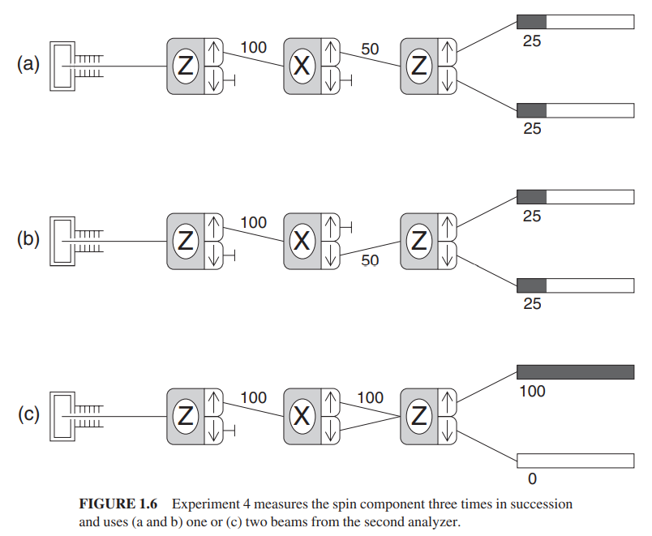

# How do I work this?

My uncle tells the story of how they help transition mechanical engineers fresh out of school to working in industry.  A senior engineer tasks them with a simple task: a near complete machine needs a piece -- it is missing a cog.  The tell the new engineer to get them one.  The new engineer studies the plans, designs the cog, painstakingly laying out the CAD designs for it, and comes back to the senior engineer after a week with his work to review how to machine that part, and how much it will cost.  The senior engineer looks it over, says it is the right piece, and pulls out a catalog, and shows him how much it will cost to buy, usually at a fraction of the cost.  The lesson they learn: don't create from scratch stuff you can buy cheaply from a catalog.

We might think of physics and mathematics having a similar relationship.  Often, as you painstakingly observe a physical system, you figure out what are the important bits you need to capture with a model, and how those bits behave in the system.  Then, you go shopping to your local math department, describing what you are doing, and hope that a mathematician can recommend a system they've already investigated that you can map your problem into, and take advantage of the notions, the notations, and theorems about the system behavior that they've already come up with.

So, let's proceed by looking at a simple spin-$1/2$ system, of electrons that can have either a spin up or down measurement, depending on how the spin-detector is oriented.  Many newer books start their quantum discussion this way, and two I can recommend that do this are _Quantum Mechanics: The Theoretical Minimum_ by Len Susskind and _Quantum Mechanics: A Paradigms Approach_ by David McIntyre.  I won't repeat their treatment here, and will assume you know the basics of measuring spins in those systems.  I will talk about how you start to pick your mathematics from the catalog to model this phenomenon.

## Lay of the Land

Here is a picture that captures some of the important information about a quantum experiment we run:

```{r, echo=FALSE, out.width="75%", out.height="75%", fig.align="center", fig.cap="Two-spin experiment, McIntire"}

```

Some notes on the picture:

- The apparatus on the left emits electrons, which have a spin we want to measure.
- The detectors are labeled with a 'Z' or 'X' to tell you which direction in space we are orienting the detector.  We pick the directions arbitrarily, but 'Z' and 'X' are orthogonal directions.
- The arrows on the detectors indicate which spin orientation an electron comes out of.  If it is measured with a spin up, relative to the how the detector is oriented, it exits from the top port, with the up arrow.  If down, it exits from the lower port.
- The labels `|+>` and `|->` are also labels for the spins.  The indicate absolute directions of the spin (spin up or down in the Z direction), rather than the up and down arrows on the port, that indicate if the spin is up or down *relative to the how the port is oriented*, in the 'Z' or 'X' direction.
- The labels `|+>`_x and `|->`_x represent the absolute spin up/down orientations, but for the X direction.  Again, the detector can be reoriented, but if the electron has one of these labels, it is independent of how the detector is oriented.
- The numbers and shaded bars represent a percentage of electrons that end up in that bucket or state over a large number of electrons entering the system.  Like a histogram.


Here are some things you, the experimenter, observe about the system:

- In (a), if you measure the Z spin, then the X spin, then the second time you measure the Z spin, it will be 50-50 up/down.
- In (b), it just tells you that the same thing happens, no matter if the secon measurement for X is up or down, like in experiment (a).
- In (c), somthing really weird happens: If you put the X spin detector in the middle, but carefully recombine both beams, as if you didn't measure the X spin, then the Z spin will be as if you didn't measure X spin at all, and stays in the spin state you measured it in in the first detector.

That can stand as the first of many weirdnesses you encounter in quantum.  As McIntyre says: going from (a) or (b) to (c), it's as if you are in a half-lit room, throw open a window shade, and the whole room goes dark.  In a classical model, (c) would still have a 50-50 split of spin measurements, but that doesn't happen in the quantum world.


## What things do we need to model this?

So, we make the following observations.

- If we measure a spin as up in the Z direction, and keep measuring the spin with detectors all pointed along the same Z axis, we will always get the same spin up measurement.  That is true as long as we don't orient the detector in a different direction.
- Focusing on Z measurements, we have two states: spin up (`|+>`) and spin down (`|->`).  We get that with the detector registering a +1 or -1.
- If we measure a Z spin with a detector, and it registers a +1, we call it spin up, and take a second, identical detector, and flip it upside, it will register a -1. This scenario is not pictured.
- If we take a Z detector and measure a spin up electron, and then take a second detector, and start to slightly tilt the detector away from a straight Z orientation, we still only measure +1 and -1 readings.  For a slight tilt, almost all electrons will measure spin up, and a few spin down.  As it rotates to be perpendicular to the Z direction, electrons measure +1 and -1 with a 50% probability.  As we get closer to the tilt making the detector upside down, then most of the electrons will measure -1, until it is exactly upside down, and the detetcor will consistently measure -1.

This is kind of weird.  Note that if this were a classical spin, you would expect that if you measured a spin of +1, and tilted the detector a little bit, you would measure a value a little less than +1.  But quantum doesn't work that way.  Instead of reducing the spin a little bit, what happens is that the probability of a +1 starts to decrease as you tilt the detector.  The *average* of multiple measurements approaches the value of what you would expect a single measured spin to decrease by (if it were classical).

So, whatever math we come up, it can't be the same classical math that gives a single spin measurement decreasing continuously from +1.  It has to be something that accounts for:

- A spin will always either be +1 or -1
- The *probability* of detecting +1 and -1 change as you tilt the detector.

So we go talk to the math department...

