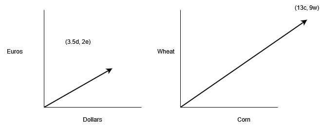

# Eigenvectors and Eigenvalues

Part of the motivation from the last chapter was to simplify calculations.  The simplification process was something like this:

* Instead of talking about each vector uniquely, find a small set of vectors through which you can express every other vector in that space you could possibly want to talk about.
* Be picky about that set, and pick the smallest set of vectors you can get away with.
* Find a relatively easy function (inner product) that makes calculating the scalars  that you need to use with that small set of vectors to represent any other vector.
* Be more picky about that small set of vectors (the basis) in a way that makes computing the scalars more computationally simple -- that is by selecting a set of vectors that are mutually orthogonal.  This makes a lot of terms in the scalar computation reduce to zero and make a simpler computation.
* Be even more picky about that set and make sure the *length* of the basis vectors are $1$.  This gives you an orthonormal basis.

These ways of being very picky about what basis set of vectors you choose to represent any other vector in the space pays off by making the scalar multiplier computations you need to make to get the right expression much more simple by introducing a lot of zero terms.

Having vectors lying around seems pretty limited in its usefulness.  On their own, they don't really do much.  You can think about using vectors to keep track of things like position of a particle, or velocity of an airplane, but by themselves, they don't give you much more than an accounting system of limited use.

So how do we make them useful?  It turns out that one of the powerful things to do with vectors is to transform them from one vector into another.  Why?  One way is by giving you the tools to figure out where you have to aim an initial vector in order to hit a target vector.  Let's do an example.

The common example is linear systems of equations.  I grew up on a farm, so let's talk about Crazy Larry's Seed Shop.  Here, you can use dollars or euros (because if I recall anything about my rural upbringing, it was very cosmopolitan).  However, these are the rules for how Crazy Larry will sell you stuff (he's not crazy because of his low, low prices):

* For every dollar you pay him, he will give you 2 bags of corn and 2 bags of wheat.
* For every euro you pay him, he will give you 3 bags of corn and 1 bag of wheat.
* This is all proportional.  Half a dollar will get you 1 bag of corn and 1 bag of wheat, etc.
* If necessary, the trade can go the other way.  Crazy Larry will pay you a dollar if you give him 2 bags of corn and 2 bags of wheat, etc.

That's the deal.  Crazy, right?

So, you do some sample trades to get a feel for what goes on.

* If you give just a dollar or just a euro, you get what was laid out in the rules above -- very simple.
* If you give 1 dollar and 1 euro, you get 2 bags of corn and 2 of wheat from the dollar, and 3 of corn and 1 of wheat from the euro, for a total of 5 bags of corn and 3 bags of wheat.
* If you give 8 dollars and 3 euros, you get a total of 25 bags of corn and 19 bags of wheat.

Another thing that makes Crazy Larry crazy is that he is inflexible in these rules.  You can't just ask him "how much if I just want to buy corn alone?"  The rules are the rules, and you have to take what the rules buy you.

And so on.  Its a lot of accounting.  First, since we just spent a chapter on Euclidian vectors, let's model these calculations as vectors in a Euclidian space.  Truthfully, that's probably the biggest advantage of Euclidian spaces -- you can model a lot of problems with vectors in them.

Ok, now say you have a target -- you know how much corn and wheat you want.  Lets say you want 13 bags of corn and 9 bags of wheat.  Is it even possible to buy this from Crazy Larry?  You sit down, do some trial and error, and find out, yes, you can do this if you pay 3.5 dollars and 2 euros.

```{r, echo=FALSE, out.width="75%", out.height="75%", fig.align="center", fig.cap="Crazy Larry, of course, has drawn out his crazy scheme."}

```

Well, you can see that you can model your payment and your seed bags as vectors easily on a Cartesian (Euclidian) plane.  Let's dissect this and make the ideas explicit.

* Your payment is a vector, with the 2 components being the dollars and the euros you pay.
* Your seed received is a vector, with the 2 components being corn and wheat.
* Crazy Larry's rules are the transformation.