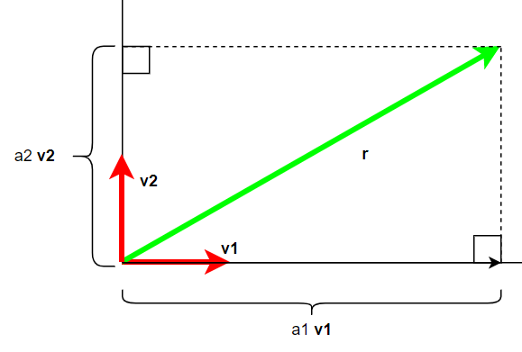
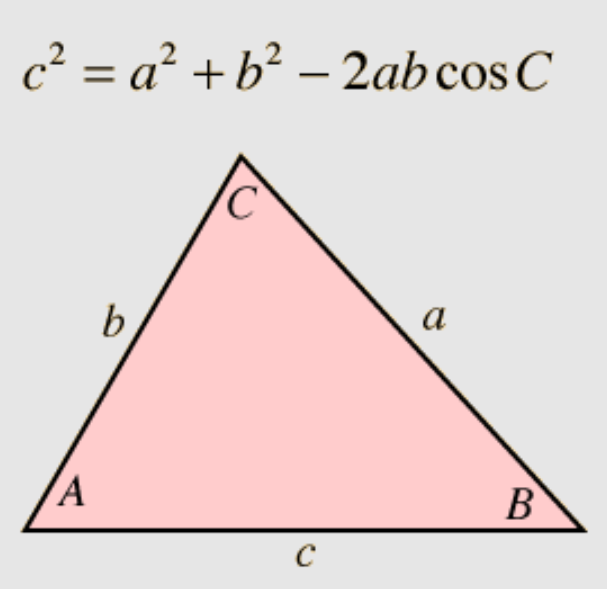

# OLD - Basic Intuitions

In the previous chapter, we did a lot of work figuring out how to calculate the length of a side of a triangle using information about the other two sides of the triangle.  We also observed that we could pick almost any two vectors in $\mathbb{R}^2$ and represent any other given vector by shrinking or stretching those two vectors independently and then adding them together.

We haven't talked about why we care, or why it is important that we can decompose lengths and vectors like this.  Let's work by analogy with long multiplication.  If you ask me to multiply $87 \times 396$, I can't tell you the answer directly.  But via the multiplication algorithm, which gets you to the answer by single-digit multiplications, keeping track of place value, and adding up the parts, I can get to the answer.

If we can decompose any vector down into a linear combination of the same two vectors, and we can determine a calculation on a vector by a linear 


Vector spaces are based on a similar idea.  Most computations on vectors are kind of hard.  Let's assume we have a function $f$ we want to calculate on a vector $\vec{c}$ -- $f(\vec{c})$.  Assume we can write $\vec{c}$ as:

$$\vec{c} = \alpha\cdot\vec{a} + \beta\cdot\vec{b}$$
So then

$$f(\vec{c}) = f(\alpha\cdot\vec{a} + \beta\cdot\vec{b})$$
Let's further assume that, like with multiplication, you can break your computation down by doing the same computation on the constituent parts.  Like so:
$$f(\vec{c}) = \alpha\cdot f(\vec{a}) + \beta\cdot f(\vec{b})$$

If 

In the previous chapter, we related the geometry and trigonometry of triangles to inner products.  The main take-away there should be that inner products between two lines (or rather, vectors, which are directed lines, and which I here assume you have a background in) measure how much they point in the same direction, and account for how long each vector is.  It turns out that with the definition of the inner product, we can write more general form of the Pythagorean Theorem that can be used to calculate any side length of a triangle in terms of the other two, instead of just for right triangles.  Furthermore, knowing how vector addition and scalar multiples of vectors work, we can, for $\mathbb{R}^2$, pick just about any two vectors, and write any other third vector in terms of a sum of scalar multiples of those original two vectors.

The motivating assumptions here are:

* Inner products are pretty easy to calculate, as are addition/subtraction/multiplication/division of scalars.
* When working with vectors, it is easiest when you can represent any random vector in terms of a set of pre-determined vectors.  And it is even better if those vectors in that set are all orthonormal.  In this case, it make the calculations even simpler.


## Properties of inner products

One of the properties of the inner product is that it is distributive.  We always here this, but we are never really told why this is important.  Having a function, like 


<!--

To review, we used geometry and trigonometry to calculate the length of a side of a triangle in terms of the other two sides and the angle between those other two sides.  This linked the Pythagorean Theorem to the Law of Cosines.  Next, we showed that the quantity known as the *inner product* was involved in these computations.  Further, we could express any vector in terms of two other vectors that were both scaled appropriately and then added together.  The scaling values we use can be calculated using just the inner product and basic arithmetic operations.

So, we've got a decent start on intuition about inner products in $\mathbb{R}^2$.  They tell us if lines point in the same, opposite, or perpendicular directions, based on if the inner product of two vectors is positive, zero, or negative respectively.  They can be used to create Pythagorean-like relations between lengths of sides of any triangle, not just right triangles.


As with most useful finds in life, you grope around blindly in the darkness for a long time, stumbling and swearing, messing up, giving up, coming back, and sometimes tripping over something useful. If what you trip over is really useful, you take it to the garage, clean and polish it, put it on display, and tell lies about how you followed a primrose path, stemming from your genius, to its discovery, making people in awe of you.

We're going to follow that a bit.  It will have some convenient lies that will have enough grains of truth in it to be helpful.  I don't pretend to know the history of how linear algebra came into its present form, but I have made a satisfying hero's origin story narrative that has helped me keep important notions straight.  I'll tell that lie here.


## Starting with what we know

The approach I'll take here is to start with $\mathbb{R}^2$, and work up to more general abstractions.  We'll start with the most commonly understood stuff, and then start to wiggle stuff around to see what happens and how we can use it.  We will rely on things we know intuitively about Euclidian space, like being able to construct perpendicular and parallel lines, measure lengths and angles, and the like.  Then we will start to erase and replace things with more abstract concepts, until we get to a level of some abstract generality.  With this established, we will hop over to the vector space of quantum states, and we'll be able to pull over the general abstractions, as some of the concrete intuitions don't work in quantum vector spaces.


### Scenario 1: Orthonormal vectors

```{r, echo=FALSE, out.width="75%", out.height="75%", fig.align="center", fig.cap="How most of us understand vector decomposition"}
# From https://www.examfear.com/notes/Class-11/Physics/Motion-In-A-Plane/769/Unit-Vectors.htm :
# From: http://www.nabla.hr/CO-VectCoordSys1.htm

```

This is picking vectors so that you have effectively the Cartesian coordinate plane that you are used to -- $v1$ and $v2$ act like the x- and y-axis of your high school years.

To recap the highlights:

- You are given two vectors that are perpendicular to each other (*ortho-*), $\vec{v1}$ and $\vec{v2}$, and are of unit length(*-normal*).
- You are given the vector $\vec{r}$
- You figure out the way to write $\vec{r}$ in terms of $\vec{v1}$ and $\vec{v2}$ by dropping perpendiculars to the lines determined by $\vec{v1}$ and $\vec{v2}$, and then figuring out the ratio of the length of those intersections to the origin to the length of the individual unit vectors.  We call those lengths $a1$ and $a2$ respectively.
- You can then write $\vec{r}$ as follows:

$$\vec{r} = a1 \cdot \vec{v1} + a2 \cdot \vec{v2}$$ 

The big idea here is that, because we can draw perpendiculars and measure lengths (which we are allowed to do because we can do all of the good things the geometry we learned allows us to do), it's easy to compute the scalars $a1$ and $a2$.

I contend that it is pretty self-evident here that the following two statements are true:

- You can figure out the scalars (also known as *components*) for $a1$ and $a2$ for *any* vector $\vec{r}$, no matter the size or direction.  You can do this with geometric tools (marking of unit lengths, dropping perpendiculars or drawing parallels -- anything you can do with a compass and straight-edge).
- If you have $\vec{r}$ in hand, the values you compute for $a1$ and $a2$ are unique -- you can't use some other way of constructing parallels and measuring lengths, and legitimately come up with different numbers.

This seems like a boring observation, but, as I've said before, this will be important.


### Scenario 2: Getting a little more artsy: any two linearly independent vectors

```{r, echo=FALSE, out.width="75%", out.height="75%", fig.align="center", fig.cap="Scalars decomposition using general vectors."}
knitr::include_graphics('images/parallelogram-decomposition.png')
```

You might find yourself in a situation where you have two reference vectors that are not perpendicular to each other, and not of unit lenghts.  That is the situation above.  It is not neat and familiar like the first orthonormal case.  But it will work.  Any vector $\vec{r}$ can be written by stretching or shrinking both $\vec{v1}$ and $\vec{v2}$ by just the right amounts so that you can add them, parallelogram-wise, to get to the same spot as $\vec{r}$.

The one caveat is that in this case, instead of dropping perpendiculars to lines, we constructed lines parallel to each of the different vectors through the end of $\vec{r}$.  We could have constructed parallels in the orthonormal case as well, and gotten the same results.  The interesting thing to keep in your back pocket is, if you ever end up studying tensors, these alternate ways of finding the *components* of the vectors are both used, depending on if you want what tensors refer to as *contravariant* or the *covariant* components.  It's not exacly like we show here, but very, very close in spirit.  So it's nice to have an example.  See: http://www.danfleisch.com/sgvt/ .


### Important observations

We should have a pretty good intuition that the amount we have to stretch vectors to have it represent $\vec{r}$ are going to totally depend on which vectors $\vec{v1}$ and $\vec{v2}$ you use as your reference set.  To be clear, for $\mathbb{R}^2$, the two independent vectors you choose to represent any other arbitrary vector $\vec{r}$ is called the *basis*.

We are able to use our intuition on $\mathbb{R}^2$ because we understand how geometry works.  We know how to draw perpendiculars and parallels, and measure distances.  When we got to more abstract spaces, or when we use complex numbers as a scalar field, we will have to leave our intuition behind, as we won't really have perpendicular and parallel lines to deal with.  We will have to replace "perpendicular" with "orthogonal", which we will be able to determine by having the inner product being 0.

The scaling factors $a1$ and $a2$ are called the *components*, to repeat myself.  Components are important because they are the numbers that actually get thrown around, showing up as the entries in any matrix and vector representation once a basis is chosen.

Note that the vector $\vec{r}$ is it's own, eternal, platonic thing.  It exists no matter what two basis vectors you choose to decompose it in.

Every vector can be decomposed into a set of basis vectors and appropriate scalar factors.  We pretty much have to decompose an arbitrary vector into it's basis representation to do any meaningful computations on the vector.


## Inner products

Inner products, in their most general form, don't seem to lend themselves to a good intuition.  Parts of inner products have useful interpretations, in certain circumstances, but it will be helpful to build up to that.

So let's start with a place where the inner product shows up naturally -- The Law of Cosines:

$$(\text{Law of Cosines}) \ \ \  c^2 = a^2 + b^2 - 2 a b \ cos(C)$$

```{r, echo=FALSE, out.width="50%", out.height="50%", fig.align="center", fig.cap="Law of Cosines"}

```

Before we get to formal definitions, we will take for given the fact that the inner product in Euclidian space is defined as:
$$<\vec{x},\vec{y}> = |\vec{x}| \cdot |\vec{y}| \cdot \cos(\theta)$$
That is, the inner product between two vectors (lengths, in this case), is the product of the lengths of the two vectors multiplied by the cosine of the angle between the vectors/lines.

We will take for granted that we can write the vector lengths with just plain Roman letters.

You can think of the law of cosines as a generalized Pythagorean theorem.  You can figure out the length of a third side $c$ if you know the other two sides of the triange $a$ and $b$, but *adjusting for how much in the same direction $a$ and $b$ are.*

Let's imagine some limiting cases.  Consider $a$ and $b$ as fixed lengths.  As angle $C$ widens to be close to 180 degrees, the triangle height shrinks to 0, and $c$ becomes equal to $a + b$.  The limit in the law of cosines agrees with this -- as $C \rightarrow 180$, then $cos(C) \rightarrow -1$, and so the law of cosines becomes:

$$c^2 = a^2 + b^2 - 2 a b (-1) = a^2 + b^2 + 2 a b = (a + b)^2$$
or, $c = a + b$.

At the other extreme, as $C$ shrinks to 0, the triangle again collapses, and $a$ and $b$ are again in the same line, but but this time $c$ approaches the *difference* of $a$ and $b$.


$$c^2 = a^2 + b^2 - 2 a b (1) = a^2 + b^2 - 2 a b = (a - b)^2$$
or $c = a - b$, or $b - a$, whichever doesn't give you a negative number.

In between, at some point, $C$ becomes a right angle.  In that case, $cos(C) = 0$, and the entire last term goes to 0.  Then we are just left with the formula fom the Pythagorean Theorem.

One way to think about this is that the last term in the law of cosines is an adjustment factor for *how collinear $a$ and $b$ are.*  When $C = 180$, $a$ and $b$ are in opposite directions, and the Pythagorean theorem underestimates how long $C$ is, and we have to add that factor to the computation to get the right length.  At the extreme of $C = 0$, the Pythagorean theorem *overestimates* $c$, so we have to subtract some to get the right amount.

In between, when the lines are perpendicular, no adjustment to the Pythagorean theorem calculation is needed.

So, when the angle is small, the lines point pretty much in the same direction, and the inner product is more positive.  At the other end, when the angle is wide, the lines are pointing away from each other, and the inner product is more negative.

So you can get the idea that the inner product measures some notion of two lines pointing in the same, opposite, or perpendicular direction, based on the size of the inner product value.

As an aside, there's some cool analogs between $cos$ and $sin$.  You may recall that:

$$\vec{x} \cdot \vec{y} = |\vec{x}| \cdot |\vec{y}| \cdot \cos(\theta)$$
and 
$$|\vec{x} \times \vec{y}| = |\vec{x}| \cdot |\vec{y}| \cdot \sin(\theta)$$
There is a bit of a parallel going on here.

cos | sin |
------------------------------ | ------------------------------ |
Gives a sense of how collinear two lines are | Gives a sense of how much planar area (the paralleleogram they define) the lines subtend |


I will start with the admission: I don't know what, in general, a good interpretation is of the inner product in general.  What I do have are good interpretations for the inner products when one or both of the vectors in the inner product is of unit length, and also when one or both of those vectors are orthogonal to each other.  Let's start by talking about why we care.

We've already pointed out that it is easier to deal with a vector in the vector space if we can reduce it to the sum of scalar combinations of a fixed set of vectors that we always use (like a fixed set of rulers in different directions).  In $\mathbb{R}^2$, we've shown how you can start with your basis set of vectors and use a compass and straight edge to help you figure out what scalars you should use on those basis vectors to represent the original vector.

But what happens if, say, the dimension of your space gets bigger than 3?  I have no idea how to use a compass and straight edge if it's not on a piece of paper.  What I really want is an easy process to get the scalars for my vectors in any dimension, and not have to use the compass and straight-edge.  What we need is some sort of function that can take in two vectors, like a vector you want to decompose, and one of the basis vectors you want to focus on, and spit out the scalar that you will need to multiply the basis vector by when you are trying to represent the vector you want to decompose.

Enter the inner product function.  This function, should you have one, will give you these scalar coefficients *provided that the basis set you have is made up of mutually perpendicular vectors and they all have unit length (i.e., orthonormal)*.  If your basis vectors don't meet this criteria, it won't work out of the box, but there is stuff we can do to still make the inner product ultimately get you what you want.  We'll address that later.

The function for an inner product is typically written as: $\sqrt{<\cdot,\cdot>}$

Here's how an inner product function is defined on a vector space.  Do not study this too hard just yet.  It's enough to know it has some weird stuff going on right now that looks like it doesn't really have much to do with what we want to use it for.

```{r, echo=FALSE, out.width="100%", out.height="100%", fig.align="center", fig.cap="Like with Medusa, don't look directly at this, at least not yet."}
knitr::include_graphics('images/inner-product-definition-wikipedia.png')
```

Let's talk a little bit about what some of the definition is there to do.

First, in geometry, we know that vectors have lengths.  Inner products somehow have to account for dealing with lengths.  The way this is addressed is by making functions that qualify as inner products have the property that, for any vector, $\sqrt{<\vec{x},\vec{x}>}$ maps to the length of your vector.  Really, once all of the other conditions of the inner product are fufilled, this actually *defines* what is meant by length of vectors in your space.

Second, the inner product is used to tell us when vectors are orthogonal (in $\mathbb{R}^n$, this means that vectors are geometrically perpendicular).  Vectors that are orthogonal have their inner product being 0.  That is, if $\vec{x}$ and $\vec{y}$  are orthogonal, then $<\vec{x},\vec{y}> = 0$.

To look ahead -- once you have a orthonormal set of vectors $\{\vec{x}_{1},\vec{x}_{2}, ..., \vec{x}_{n}\}$, you will be able to write any vector $\vec{x}$ as

$$\vec{x} = <\vec{x}, \vec{x}_{1}> \vec{x}_{1} $$
-->

